# Dedenne-Bot

## 1. 개발 내용

- `command_prefix`를 사용하지 않고, 비슷한 의미의 여러 단어(한글포함)를 인식해서 작동하는 디스코드 봇
- (숨김 처리된 기능) 유투브 API를 이용하여 음악 재생, 리스트 설정 기능을 제공하는 디스코드 봇
- 로스트아크 API를 이용하여 관련 정보를 제공하는 디스코드 봇

 

## 2. 기술 스택

| python | MySql |
| :--------: | :--------: |
|      |       |

 

## 3. 작동 예시

### 3.1 음악 재생 기능

> 자주 사용되지 않아 숨김 처리된 기능입니다.

음악 조회 및 재생목록에 추가 
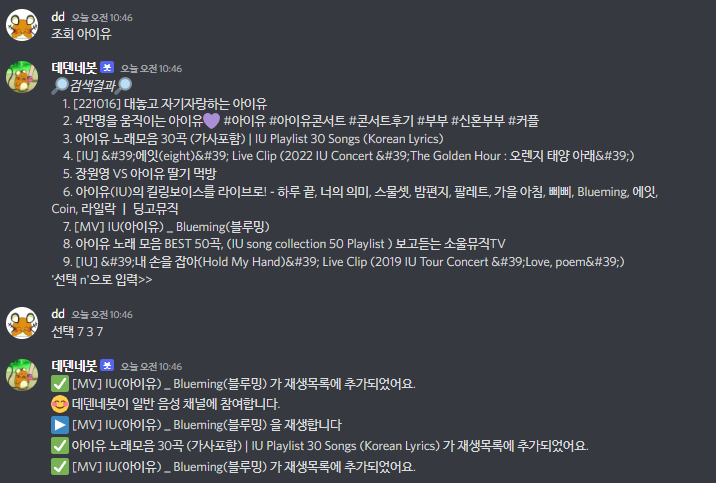
 

재생목록 조회 및 셔플 
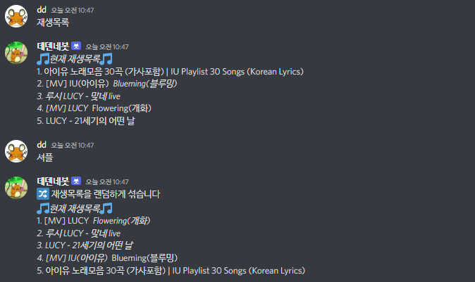
 

재생목록에 추가2 
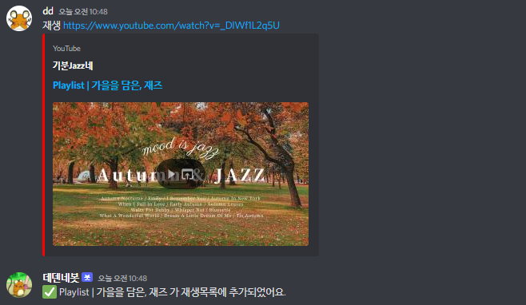
 

중단/재생/멈춤/재개 
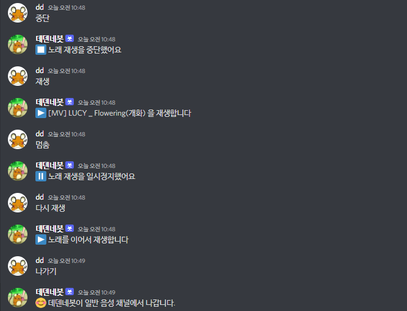
 

 

### 3.2 로스트아크 기능

캐릭터 정보 조회 
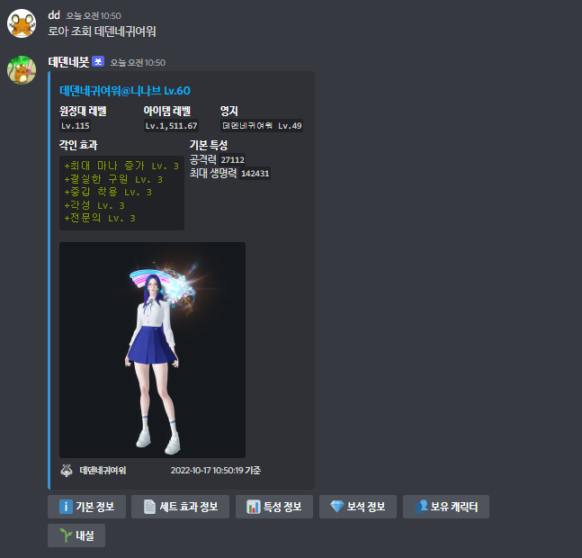
 

마리샵 판매 품목 조회 
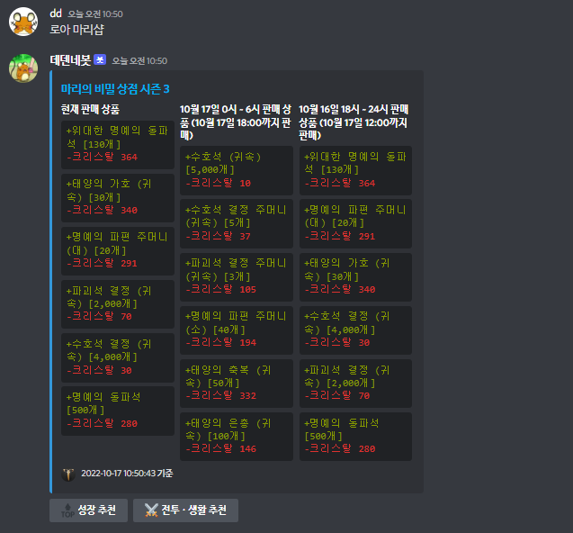
 

> 지금은 지원하지 않는 기능

골드 시세 조회 
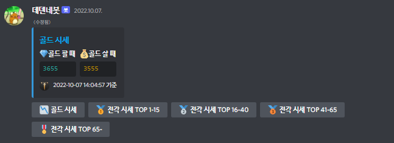
 

전설 각인서 조회 
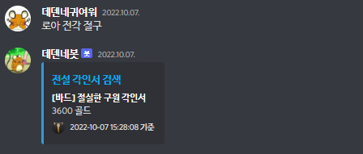
 
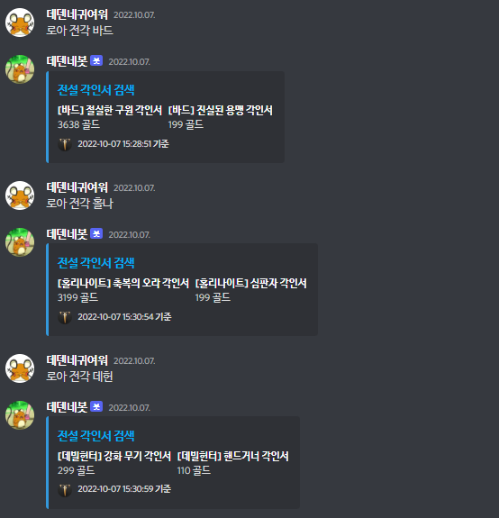
 

점령전 및 모험섬정보 
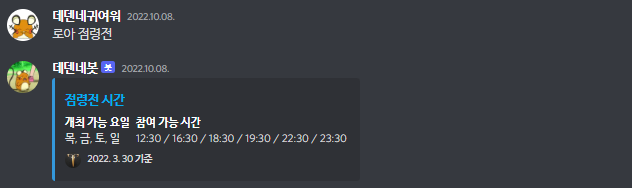
 
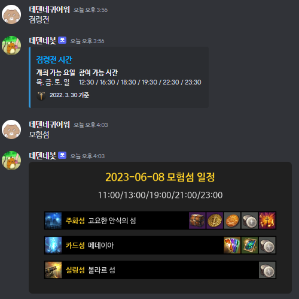
 

> 지금은 지원하지 않는 기능

레이드 정보 조회 
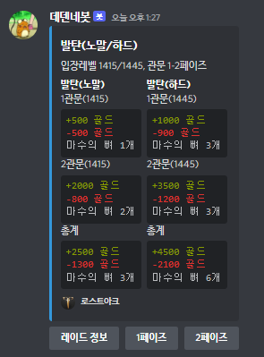
 
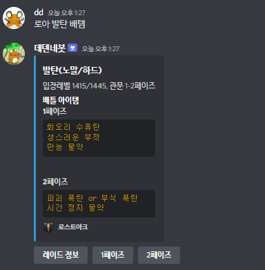
 

아이템 검색 기능 
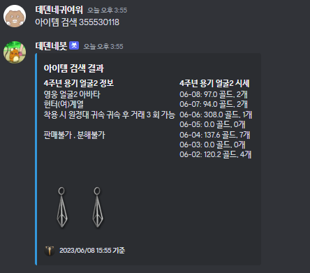
 

보석 시세 검색 기능 
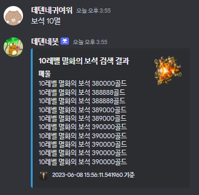
 

주간 도전 컨텐츠 조회 기능 
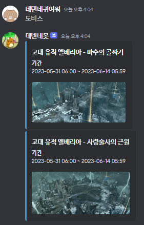
 
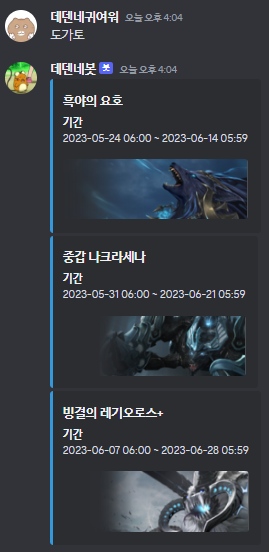
 

이벤트 조회 기능 
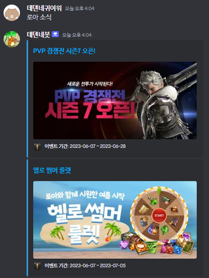
 

gif 생성 기능 
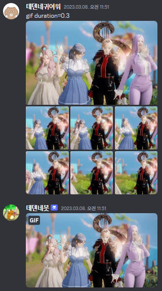
 

 

## 4. 사용법

- `봇` 또는 `bot` 글자가 들어간 채팅 채널에만 반응합니다
- 키워드에는 총 두 가지 분류가 있습니다 [음악 재생](#211-음악-재생) 및 [로스트아크](#212-로스트아크)

 

### 4.1 키워드

- <b>도움말</b>
    - 도움말 출력
    - 키워드: `사용법`/`도움말`/`help`
    - 사용 예) 사용법
 

#### 4.1.1 음악 재생

> 자주 사용되지 않아 숨김 처리된 기능입니다.

<i><s>
- <b>참여</b>
    - 음성 채널에 참여
    - 키워드: `참여`/`join`
    - 사용 예) 참여
 

- <b>나가기</b>
    - 음성 채널에서 나가기
    - 키워드: `나가기`/`leave`
 

- <b>검색</b>
    - 유투브에서 키워드로 영상을 검색
    - 키워드: `검색`/`조회`/`search`
    - 사용 예) 검색 [키워드]
 

- <b>선택</b>
    - 검색 결과 중 원하는 영상을 선택해 재생목록 추가
    - 복수 개의 결과 추가 가능
    - 키워드: `선택`/`select`
    - 사용 예) 선택 1, 선택 3 5
 

- <b>추가</b>
    - 유투브 링크를 재생목록에 바로 추가
    - 키워드: `재생`/`추가`/`add`
    - 사용 예) 재생 [유투브링크]
 

- <b>재생목록</b>
    - 현재 재생목록을 보여 줌
    - 키워드: `재생목록`/`재생 목록`/`queue`
    - 사용 예) 재생목록
 

- <b>스킵</b>
    - 재생중인 영상을 스킵함
    - 키워드: `스킵`/`넘기기`/`skip`
    - 사용 예) 스킵
 

- <b>중단</b>
    - 영상 재생을 중단함
    - 키워드: `중단`/`stop`
    - 사용 예) 중단
 

- <b>멈춤</b>
    - 재생 중인 영상을 일시정지함
    - 키워드: `멈춤`/`일시정지`/`pause`
    - 사용 예) 멈춤
 

- <b>재개</b>
    - 일시정지한 영상을 이어서 재생함
    - 키워드: `재개`/`다시재생`/`다시 재생`/`resume`
    - 사용 예) 다시 재생
 

- <b>재생목록 섞기</b>
    - 재생목록을 랜덤하게 섞음
    - 키워드: `셔플`/`섞기`/`shuffle`
    - 사용 예) 셔플
 
</i></s>

 

#### 4.1.2 로스트아크

<b>🔎 캐릭터 정보 조회</b>

     - 캐릭터의 정보를 조회합니다
     - 키워드: 캐릭터 검색/캐릭터 조회
     - 사용 예) 캐릭터 조회 데덴네귀여워

 

<b>📦 아이템 검색</b>

     - 로스트아크 아이템 시세를 검색합니다
     - 아이템ID는 Lost Ark Codex에서 확인합니다
     - 키워드: 아이템 검색 [아이템ID]/아이템 조회 [아이템ID]
     - 사용법 확인: 아이템 조회 사용법/아이템 조회 방법
     - 사용 예) 아이템 검색 355530118

 

<b>💎 보석 검색</b>

     - 로스트아크 3티어 보석의 시세를 검색합니다
     - 키워드: 보석 [보석명]
     - 사용 예) 보석 7
     - 사용 예) 보석 8멸
     - 사용 예) 보석 홍

 

<b>💰 마리샵 정보 조회</b>

     - 마리샵에서 판매중인 상품 정보를 조회합니다
     - 키워드: 마리샵/마리 상점
     - 사용 예) 마리샵

 

<b>📓 로스트아크 전각 시세 검색</b>

     - 전설 각인서 가격을 검색합니다
     - 당일 평균 구매가, 거래수량이 표시됩니다
     - 키워드: 전각 [각인서명]/전설 각인서 [각인서명]
     - 사용 예) 전각 타대

 

<b>🚩 점령전 정보 조회</b>

     - 점령전 정보를 조회합니다
     - 키워드: 점령전
     - 사용 예) 점령전

 

<b>🏝 모험섬 정보 조회</b>

     - 모험섬 정보를 조회합니다
     - 당일의 모험섬 정보가 표시됩니다
     - 키워드: 모험섬
     - 사용 예) 모험섬

 

<b>🕋 도전 어비스 던전 정보 조회</b>

     - 금주의 도전 어비스 던전 컨텐츠를 조회합니다
     - 키워드: 도비스/도비/도전 어비스 던전
     - 사용 예) 도비스

 

<b>👾 도전 가디언 토벌 정보 조회</b>

     - 금주의 도전 가디언 토벌 컨텐츠를 조회합니다
     - 키워드: 도가토/도가/도전 가디언 토벌
     - 사용 예) 도가토

 

<b>📰 로스트아크 소식 조회</b>

     - 로스트아크에서 현재 진행 중인 이벤트/뉴스를 조회합니다
     - 키워드: 로스트아크 뉴스/로아 뉴스/로스트아크 소식/로아 소식
     - 사용 예) 로아 소식

 

<b>🖼 gif 만들기</b>

     - 명령어와 함께 첨부한 이미지들로 gif를 만듭니다
     - 형식에 맞추어 duration을 지정하면 이미지들의 재생 속도를 변경할 수 있습니다
     - duration을 지정하지 않으면 기본 속도 (장당 0.3초)로 재생됩니다
     - 키워드: gif (duration=0.3)
     - 사용 예) gif (사진첨부)
     - 사용 예) gif duration=0.1 (사진첨부)

 

 

## 라이센스

MIT &copy; [ITJEONG](mailto:derbana1027@gmail.com)
